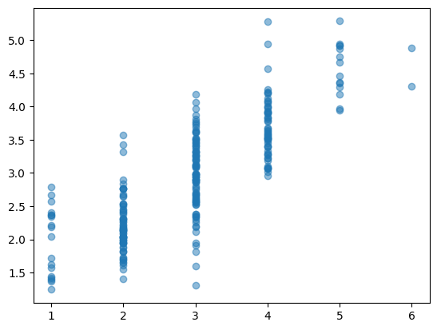

# Automated Essay Grading Using Language Models
This use case is from the Kaggle competition [Automated Essay Scoring 2.0](https://www.kaggle.com/competitions/learning-agency-lab-automated-essay-scoring-2) held in 2024. The goal of this competition is to automatically assign a grade to a short essay written by an elementary aged student. In theory, this could be used as a teaching aide for students to receive instantaneous feedback on their work

## Modelling Approach
I use an encoder-only model - [DeBERTa](https://github.com/microsoft/DeBERTa) - to estimate the score of an essay on a scale of 1 (low) to 6 (high). Encoder-only models are used in natural language processing in situations where a long piece of text (an essay) must be condensed into a small, typically numerical, value (a score). 

DeBERTa is already extensively pre-trained, but it is necessary to fine-tune it to the task at hand. Two different training methods are used: supervised learning and contrastive learning. In supervised learning, the model is trained to directly predict the score of the essay. In contrastive learning, the model compares to different essays and predicts the *difference* between their scores. The two samples are taken such that they have high lexical similarity (*i.e.* the words used in each are similar); this allows the model to learn based on the semantics of the essay and avoid overfitting to individual words.

## Results
The figure below shows the actual predicted scores of essays in the validation set. The mean squared error is 0.369 and the quadratic weighted kappa is 0.77. These results show that the model is fairly accurate at scoring essays but it struggles at the tail ends. This occurs for two reasons. First, our training loss (mean squared error) heavily punishes incorrect predictions of outliers (*e.g.* predicting 6 when the actual score is 4). Second, there are relatively few examples of extreme scores in the training set, making it difficult to determine what a 6 or a 1 would look like.

This score falls short of the winning entries from the competition. Some additional methods used in the winning submissions are:
- Increasing the size of language model, such as DeBERTa-v3-large
- Fitting an ensemble of models trained with different folds of the training data and training parameters
- Optimize thresholds for converting decimal predictions to integers

## How to Use
This repo contains two notebooks:
- Training.ipynb contains the model training scripts and saves a trained model and tokenizer
- Inference.ipynb uses the trained model to make predictions of new essays.

The training and test data are not included in this repo but are accessible at the Kaggle link above. They should be placed in the /data folder.