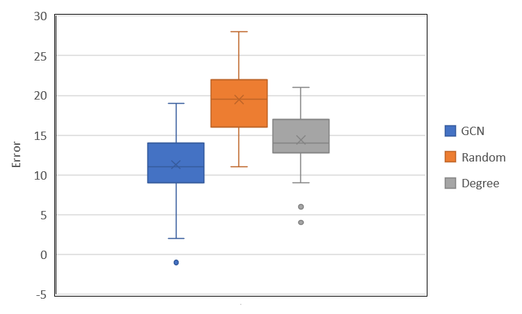

# Combinatorial Optimization Using Graph Neural Networks
This example is based on the paper [Combinatorial Optimization with Graph Convolutional Networks and Guided Tree Search](https://arxiv.org/abs/1810.10659) that introduced a heuristic combining a graph neural network for node prediction and a tree search algorithm for solving maximum independent set problems. A more recent review [What's Wrong with Deep Learning in Tree Search for Combinatorial Optimization](https://arxiv.org/abs/2201.10494) failed to replicate their results and cast doubt on the ability of such algorithms to perform well.

Here I present a generalization of the original method with a few key changes:
- The problem type is generalized from a maximum independent set to a maximum *weighted* independent set (MWIS). MWIS problem formulations are significantly more adaptible for solving real-world problems.
- The multi-headed prediction is replaced by a single prediction head. During the tree search, some noise is added to the prediction to avoid repeating the same path multiple times.
- The duration of the tree search is drastically reduced. One of the main criticisms of the original paper is that using a long tree search effectively devolves into a brute force search, rendering the neural network inconsequential. Reduced search duration allows the algorithm to better utilize the network predictions.
- The tree search randomly selects from the *p* best partial solutions and not all solutions in the queue. This biases the search towards high quality solutions. Combined with the shorter tree search time, this improves the performance of the algorithm.
- For simplicity, the tree search runs in a single thread and not in parallel.

## Results
This box plot compares solution quality on 200 node graphs using the tree search guided by three node predictors: a graph convolutional network (GCN), a random number, and the degree (number of neighbours) of the node - picking low degree nodes first. An MWIS solution found by Gurobi with a time limit of 60 seconds is used as a baseline. The GCN clearly outperforms the alternatives, supporting the original assertion that the neural network provides some benefit to the tree search algorithm.

## How to use
There are three files:
- Data_creation.py has helper functions for generating a dataset. It includes two solvers: Gurobi, a commercial mathematical programming solver; and networkx, a common Python library with tools for analyzing graphs. The Gurobi solver solves the MWIS problem directly using a integer programming approach. The networkx solver solves the maximal (not maximum) independent set problem without consideration of node weights. The Gurobi solver will give higher quality solutions at the expense of longer solve times and license requirements.
- Mwis_solution.py has the classes and functions used to train a network and solve MWIS problems.
- Demonstration.ipynb gives a minimal demonstration of how to use these functions.
